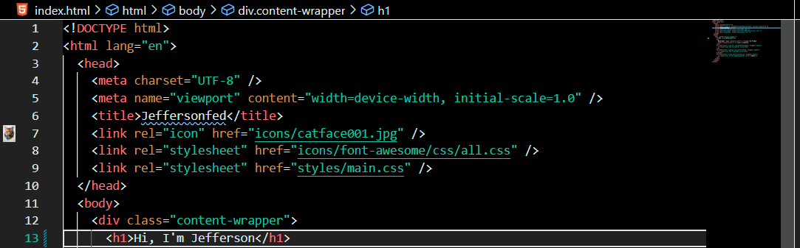

# Jefferson Dark Theme

## Why I create this Theme?
- I can see more clearly with a dark theme background (like my life).
- So my eyes don't keep getting flashbangs after using VS Code for over 2 hours.

#### Note: This is my first time creating a theme, so I know it might not be perfect. Sorry, but any advice is welcome.

## Screenshot

## Support Me!

## Author

- Jefferson
    - [Github](https://github.com/jeffersonfed)
    - [Twitter](https://twitter.com/jeffersonfed14)

## License

- [CC0 1.0 Universal](LICENSE)

